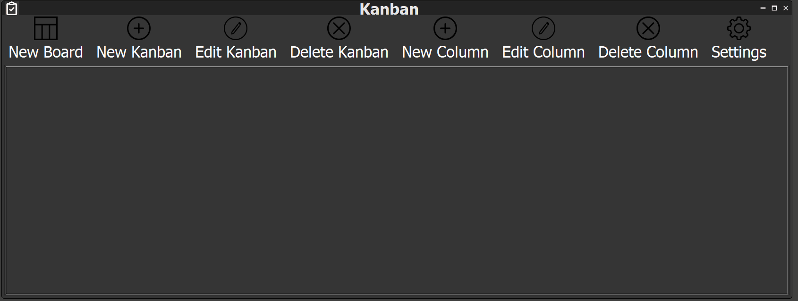
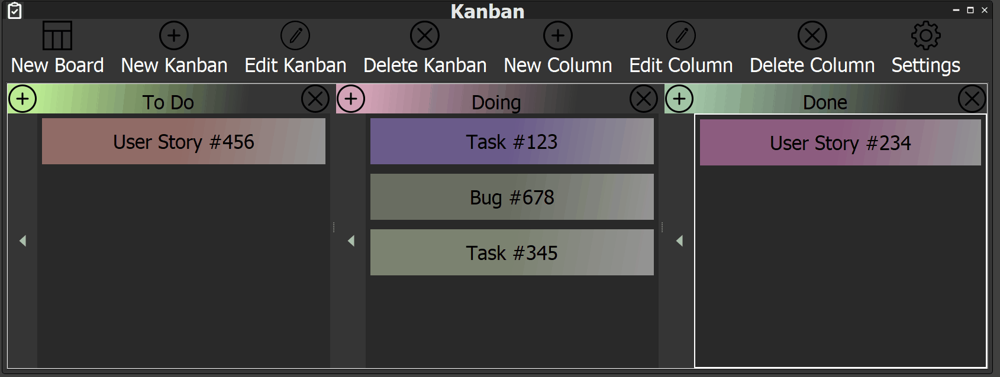
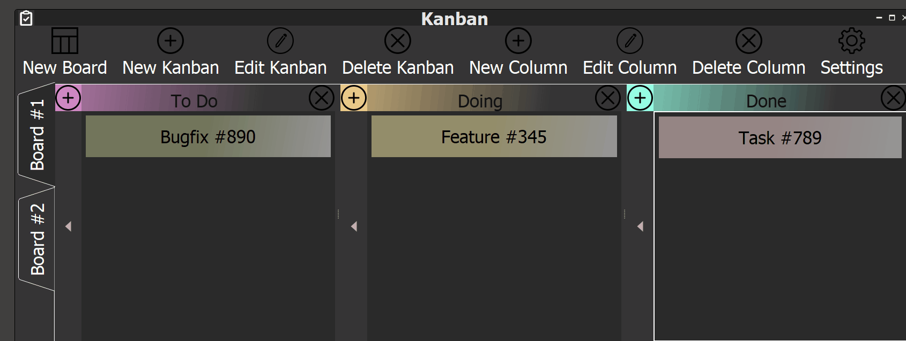
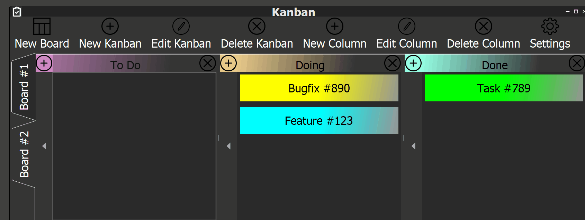
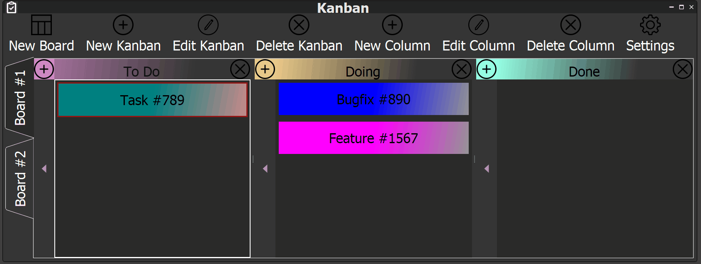
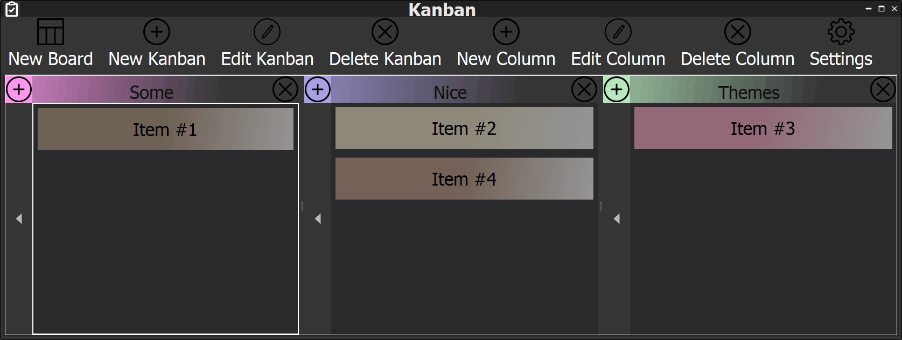

# Kanban
Kanban is a basic **Kanban Board Application** that features a **"plug-and-play"** plugin system.  
The entire application is fully extensible developing custom modules (as dynamic libraries).

### Why another Kanban-like app?
I decided to develop Kanban to sharpen out my skills in **UI Programming** and to fully architect a **Plugin System** from scratch.

### How is it done?
The entire application is developed in **C++17** and the framework eployed is **Qt5** (tested on Qt5.9.0, Qt5.11.0, Qt5.13.0, Qt5.14.1).

### Where does it run?
The application is entirely **cross-platform** (tested on Windows and Linux). It might run as well on MacOS, but it's untested.

### Ok, now show me something!

## Basic Usage:

## Bulk edits and Animations

## MultiBoards

## Item Color Editing

## Items Properties Editing

## Themes

